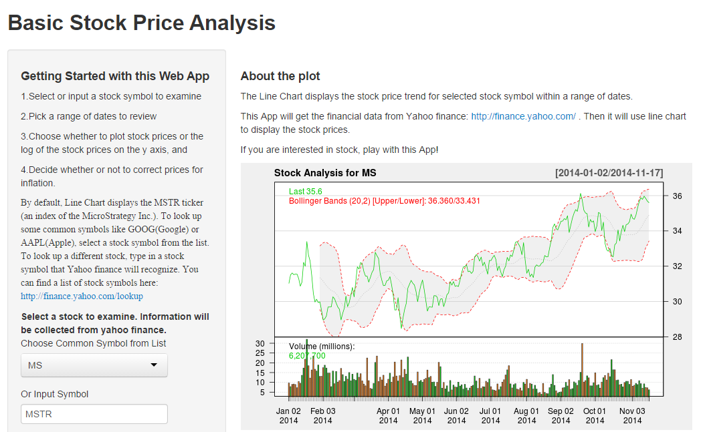

Introduction to Stock Analysis
========================================================
author: Ye Liang(Roddick)
date: 11/18/2014
transition: rotate
font-family: 'times'
width: 1440
height: 768

Background
========================================================

This project is the Course project of Developing Data Products from Johns Hopkins University on Coursera.

Based on my interest, I choose the financial data from Yahoo finance: http://finance.yahoo.com/ as the dataset. And I use a line chart to display the stock price trend. 

Also I provide some options to choose whether to plot stock prices or the log of the stock prices on the y axis, and decide whether or not to correct prices for inflation.

Code to Get Data
========================================================

StockAnalysis relies heavily on two functions from the quantmod package:
* <small>It uses getSymbols to download financial data from Yahoo finance.</small>
* <small>It uses chartSeries to display prices in an attractive chart.</small>

```r
library(quantmod)
data <- getSymbols("MSTR", src = "yahoo", from = "2014-11-17", to = "2014-11-18", auto.assign = FALSE)
head(data)
```

```
           MSTR.Open MSTR.High MSTR.Low MSTR.Close MSTR.Volume
2014-11-17    166.20    169.27   163.46     164.19       95400
2014-11-18    164.14    170.40   164.02     168.82      186500
           MSTR.Adjusted
2014-11-17        164.19
2014-11-18        168.82
```


Adjust Prices for Inflation
========================================================

The adjust function in helpers.R uses the Consumer Price Index data provided by the Federal Reserve Bank of St. Louis to transform historical prices into present day values.

```r
adjust <- function(data) {
      latestcpi <- last(.inflation)[[1]]
      inf.latest <- time(last(.inflation))
      months <- split(data)                   
      adjust_month <- function(month) {               
        date <- substr(min(time(month[1]), inf.latest), 1, 7)
        coredata(month) * latestcpi / .inflation[date][[1]]
      }      
      adjs <- lapply(months, adjust_month)
      adj <- do.call("rbind", adjs)
      axts <- xts(adj, order.by = time(data))
      axts[ , 5] <- Vo(data)
      axts
}
```

How it works
========================================================

To run this App locally, please follow the instructions on [GitHub Repo]( https://github.com/roddickyeliang/DevelopingDataProducts/tree/master/stockAnalysis)

If you are interested in stock, play with this App [here](https://roddickyeliang.shinyapps.io/stockAnalysis/)



